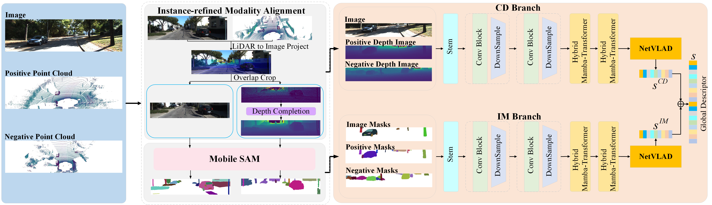

# InsCMPR
This repository contains the implementation of our paper submission: InsCMPR: Efficient Cross-Modal Place Recognition via Instance-Aware Hybrid Mamba-Transformer
* We propose a novel instance-aware modality alignment strategy for the CMPR task. By leveraging a pre-trained vision foundation model, our method aligns multi-modal data at both the pixel and instance levels, effectively mitigating domain shifts and generating superior global descriptors.
* We introduce a novel dual-branch hybrid Mamba-Transformer network for the CMPR task, capable of efficiently processing multi-modal data aligned at different levels in parallel, enhancing the robustness and accuracy of CMPR.
* Extensive experimental results on KITTI, NCLT and HAOMO datasets show that our proposed method can achieve state-of-the-art performance while running in real-time at about 30Hz.


## Table of Contents

1.[Pubulication](#Publication)

2.[Dependencies](#dependencies)

3.[How to Use](#how-to-use)

4.[License](#license)


## Dependencies
This code is tested on Ubuntu 20.04 with Python 3.7 with PyTorch 1.13.1 and CUDA 11.8 with following packages. 

Main packages: 

pytorch,torchvision, numpy, scipy, matplotlib, opencv-python

Misc packages:
pillow
h5py
scikit-image
scikit-learn
faiss_gpu
matplotlib
tqdm
causal-conv1d
mamba-ssm
timm
tensorboardX
einops
transformers

You can directly install above or using the provided requirements.txt file using pip install -r requirements.txt. However, for PyTorch and torchvision, please install them according to specific CUDA version directly from https://pytorch.org. These lines have been commented out in requirements.txt.
After installation of the above packages, activate the environment, then run the commands in "Code" section below.

If you encounter compilation errors when installing mamba-ssm and causal-conv1d, you can try the following methods to install them.
```
pip install causal_conv1d-1.0.2+cu118torch2.0cxx11abiFALSE-cp38-cp38-linux_x86_64.whl
pip install mamba_ssm-1.0.1+cu118torch2.0cxx11abiFALSE-cp38-cp38-linux_x86_64.whl
```
The .whl files of causal_conv1d and mamba_ssm could be downloaded here. {[causal-conv1d](https://github.com/Dao-AILab/causal-conv1d/releases),[mamba-ssm](https://github.com/state-spaces/mamba/releases)}

## How to Use
### Datasets preparation
#### KITTI dataset
* **setp1** LiDAR to Image Project
1. Build
```
cd ./tools/PointInterpolation
mkdir build
cd build
cmake ..
make
```
2. Run

```
./pointInterKitti
```
* **setp2** Depth Completion
```
python depth_completion_kitti.py
```
* **setp3** Generating Instance Masks

```
cd tools/MobileSAM/MobileSAMv2
bash ./experiments/mobilesamv2.sh 
```
Please use the recommended KITTI data structure as follows:
```plaintext
data
    ├── poses
    │   ├── 00.txt
    │   ├── 01.txt
    │   └── ...
    └── sequences
        ├── 00
        │   ├──depth
        │   ├──image
        │   ├──depthSAM
        │   ├──imageSAM
        │   ├──velodyne
        │   ├──depth.txt
        │   └──image.txt
        │
        ├── 01
        │   ├──depth
        │   ├──image
        │   ├──depthSAM
        │   ├──imageSAM
        │   ├──velodyne
        │   ├──depth.txt
        │   └──image.txt
        |  
        |── 02
        └── ...

```

#### NCLT dataset
NCLT datset contains data from a Velodyne32-HDL LiDAR, a Ladybug3 camera, and an RTK-GPS. The Ladybug3 camera system captures omnidirectional images from five viewpoints.
ts. We process each viewpoint individually using modality alignment before stitching the five images together.
* **setp1** Image Undistortion
```
python nclt_cam_undistored.py
```
* **setp2** Image Cropping

```
python nclt_image_crop.py
```

* **setp3** Image Stitching

```
python nclt_cat.py
```

* **setp4** LiDAR to Image Project and Depth Completion

```
python nclt_depth_crop.py
```

* **setp5** Depth Stitching

```
python nclt_cat.py
```

* **setp6** Generating Instance Masks for RGB and Depth Images

```
cd tools/MobileSAM/MobileSAMv2
bash ./experiments/mobilesamv2.sh 
```
```plaintext
data
    ├── ground_truth
    │   ├── groundtruth_2012-01-08.csv
    │   ├── groundtruth_2012-01-15.csv
    │   └── ...
    ├── 2012-01-08
    │   ├── image
    │   │    ├── Cam
    |   |    ├── Cam_SAM
    |   |    └── Cam.txt
    │   └──  lidar
    │        ├── depth
    |        ├── depth_SAM
    |        └── depth.txt
    │   
    ├── 2012-02-05
    │   ├── image
    │   │    ├── Cam
    |   |    ├── Cam_SAM
    |   |    └── Cam.txt
    │   └──  lidar
    │        ├── depth
    |        ├── depth_SAM
    |        └── depth.txt
    └── ...
```

### Training
You can start the training process with
```
python -m torch.distributed.launch --nproc_per_node=4 --use_env train_kitti.py
```
or
```
python -m torch.distributed.launch --nproc_per_node=4 --use_env  train_nclt.py
```

### Evaluation
You can start the evaluating process with
```
python ./evaluation/evaluate_kitti.py
```
or
```
python ./evaluation/evaluate_nclt.py
```
### License
This project is free software made available under the MIT License. For details see the LICENSE file.

